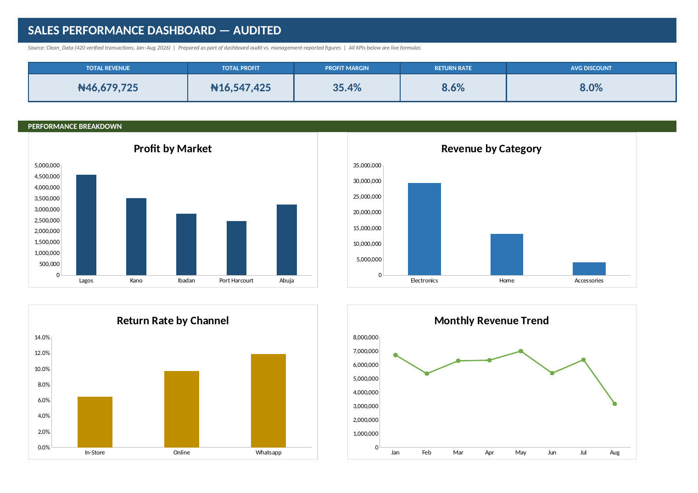

# Auditing a Sales Dashboard: When the Numbers Point to the Wrong Market

An audit of a management sales dashboard, rebuilt in Excel from a cleaned dataset of 420 transactions (Jan to Aug 2026, five Nigerian markets, three product categories, three sales channels).

## The problem

Management's dashboard drew four conclusions. I checked each one against the transaction data. Three of the four were wrong. Only the Electronics claim held up.

## Headline results

| Metric | Reported | Audited |
|---|---|---|
| Total revenue | ₦47,500,870 | ₦46,679,725 |
| Total profit | ₦16,617,270 | ₦16,547,425 |
| Return rate | 8.8% | 8.6% |
| Average discount | 8.0% | 8.0% |

## Management claims, re-checked

| Claim | Verdict | What the data shows |
|---|---|---|
| Abuja is the most profitable market | **False** | Lagos leads at about ₦4.58M profit vs. about ₦3.21M for Abuja. Lagos looked small because it appeared as three separate rows ("Lagos", "Lagos ", "LAGOS"). |
| Electronics is the strongest category | **True** | Electronics brings in ₦29.3M of the ₦46.7M revenue. |
| Higher discounting improves profitability | **False** | Average profit per transaction falls from ₦54,189 at 0% discount to about ₦23,000–25,000 at 20–25% (the 20% and 25% buckets have only 13 and 20 transactions, so read them with care). See the `Discount_vs_Profit` tab. |
| Online has the lowest return risk | **False** | In-store is lowest (6.4%), Online is 9.7%, WhatsApp is highest (11.9%). |

## Data quality issues found

- **Inconsistent state labels:** one market recorded under several spellings, which split its totals across rows.
- **Inconsistent category labels:** "Accessories", "Accessories " (trailing space) and "Accessory" were counted as three categories.
- **Revenue mismatches:** 22 of 420 transactions had a reported revenue that did not match Units × Unit Price × (1 − Discount). I recalculated these.
- **Missing cost values:** 31 transactions had no per-unit cost recorded, which would overstate profit on those rows. Corrected costs are in `Cost_Corrected_NGN`.

## Method

1. Compared reported figures to the raw export and flagged mismatches with check columns (`Revenue_Check`, `Cost_Check`, `Duplicate_Check`).
2. Standardised state, category and channel labels into `State_Clean`, `Category_Clean` and `Channel_Clean`.
3. Recalculated revenue and profit from each transaction's own inputs.
4. Rebuilt every summary table as live `SUMIFS` / `COUNTIFS` / `AVERAGEIFS` formulas over `Clean_Data`, so nothing is hardcoded.
5. Built the dashboard with native Excel charts and KPI cells.

## Workbook structure

| Tab | Purpose |
|---|---|
| `Dashboard` | KPI strip and four charts |
| `Audit_Findings` | Reported vs. audited table, issues fixed, claim verdicts |
| `Profit_by_Market`, `Revenue_by_Category`, `Return_by_Channel`, `Monthly_Revenue`, `Discount_vs_Profit` | Summary tables feeding the charts |
| `Clean_Data` | 420 verified transactions |
| `Lookup`, `Raw_Data` | Reference data and the original export, kept for traceability |

## Limitations

- August 2026 is a partial month (data runs to 26 Aug), so its low revenue is not a like-for-like comparison.
- Return rate is measured per transaction, not per naira of revenue.
- Discount analysis shows correlation in this dataset, not proof that discounting causes lower profit.

## Tools

Microsoft Excel (formulas, native charts). Dataset supplied through the DSN AI Bootcamp 2026.

## Files

- `Sales_Dashboard_Audited.xlsx`: the full workbook
- `images/dashboard.png`: dashboard snapshot

## Author

[Your name] · [LinkedIn link]
